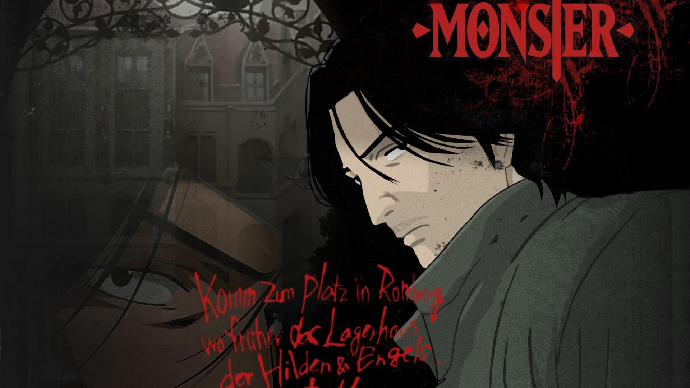

# Omarchy Monster Theme

A dark, noir [Omarchy](https://omarchy.org/) theme inspired by the anime **Monster** (Naoki Urasawa) — desaturated shadows with a blood‑red accent.



## Palette

| Role | Hex | |
|------|-----|--|
| Background | `#15110f` | warm near‑black / penumbra |
| Foreground | `#cdc3b4` | bone / aged paper |
| Accent | `#c0392b` | blood red (borders, selection, lock) |
| Deep red | `#9e1b1b` | terminal red |

## Install

```bash
omarchy theme install https://github.com/cantalusto/omarchy-monster-theme
```

Then pick **Monster** from the theme menu, or:

```bash
omarchy theme set Monster
```

To use the boot splash (Plymouth) and SDDM login logo, go to **Style → Unlock → Monster**.

## Optional: custom lock screen layout

The theme already colors the default `hyprlock` to the Monster palette. If you
also want the **custom lock screen layout** (single‑line clock, greeting, rotating
phrase, blood‑red lock icon), copy the bundled layout over your personal
`hyprlock.conf` — it pulls colors from whatever Omarchy theme is active, so it
stays in sync:

```bash
# Back up your current lock screen first
cp ~/.config/hypr/hyprlock.conf ~/.config/hypr/hyprlock.conf.bak

# Apply the Monster layout
cp ~/.config/omarchy/themes/monster/extras/hyprlock.conf ~/.config/hypr/hyprlock.conf
```

The greeting uses `$USER`, so it adapts to your name automatically. The rotating
phrases are in Portuguese — edit the `shuf -e ...` line in the file to change them.

## What's themed

`colors.toml` drives terminals (Alacritty, Ghostty, Kitty, Foot, Warp), Waybar,
Walker, Mako, GTK, btop, SwayOSD, Wofi, Vencord and Neovim. Includes a custom
Walker style, a themed `hyprlock` lock screen, a gradient active‑window border
with red groupbar (`hyprland.conf`), Cava, Steam and VS Code (built‑in *Red*)
theming, and a Plymouth/SDDM boot logo (`unlock.png`).

## Optional: Monster fastfetch

A matching `fastfetch` config (Monster ASCII wordmark + blood‑red palette,
keeping all the Omarchy system info) lives in `extras/fastfetch/`. To use it:

```bash
# Back up your current fastfetch config first
cp ~/.config/fastfetch/config.jsonc ~/.config/fastfetch/config.jsonc.bak

# Apply the Monster fastfetch
cp ~/.config/omarchy/themes/monster/extras/fastfetch/config.jsonc ~/.config/fastfetch/config.jsonc
```

The logo path points at the installed theme folder, so it works as long as the
Monster theme is installed.

## Recommended bar

This theme is used with **Quickshell Rise** — a modern Quickshell bar for Omarchy
by [HANCORE-linux](https://github.com/HANCORE-linux), not Waybar. It is **not**
bundled here; install it separately from its own repo:

➡️ https://github.com/HANCORE-linux/quickshell-dots

All credit for the bar goes to its author.

## Wallpapers & credits

The `backgrounds/` folder bundles fan wallpapers of the anime **Monster** by
Naoki Urasawa, plus one generated from the series logo. All artwork is property
of its respective creators and is included here for personal, non‑commercial use
only. If you are a rights holder and want something removed, open an issue.

## License

Theme configuration files are released under the [MIT License](LICENSE).
This licence does **not** cover the bundled wallpapers (see above).
